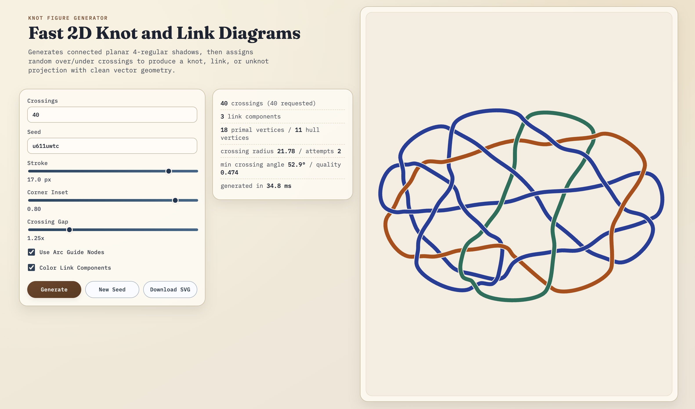

# Knotgen

A fast Svelte web app for generating large 2D knot/link/unknot diagrams as clean SVG.

## What it does

- Generates connected planar 4-regular shadow graphs.
- Assigns random over/under crossing choices.
- Renders smooth vector paths suitable for papers/slides.
- Exports directly to SVG.

## Run

```bash
npm install
npm run dev
```

Build and type-check:

```bash
npm run check
npm run build
```

## Generation pipeline

1. Take the requested crossing count `n` (with `n=4` remapped to `5` for this constructor).
2. Solve integers `(V, H)` with `n = 3V - 3 - H` and `3 <= H <= V`.
3. Sample `H` boundary points + `V-H` interior points.
4. Compute a Delaunay triangulation (maximal planar primal graph).
5. Build the medial graph: each primal edge becomes one crossing vertex; consecutive primal edges around each face define medial edges.
6. Randomly choose which opposite strand is over at each crossing.
7. Draw quadratic curves with trimmed crossing neighborhoods + overpass bridge segments.

This guarantees a connected 4-regular planar shadow while keeping crossing count fixed for all realizable `n` in this construction (`3` and all `n >= 5`).

## Notes

- This tool intentionally does **not** simplify/reduce crossings.
- Output may be a knot, link, or unknot projection.
- Focus is speed + visual cleanliness for large diagrams.

## References

- [d3-delaunay documentation](https://d3js.org/d3-delaunay)
- [Delaunator (algorithm + implementation)](https://github.com/mapbox/delaunator)
- [plantri (fast generation of planar graphs)](https://users.cecs.anu.edu.au/~bdm/plantri/)
- [A Markov Chain Sampler for Plane Curves](https://arxiv.org/abs/1804.03311)
- [Circular Lombardi drawings for knot and link diagrams](https://arxiv.org/abs/1708.09819)
